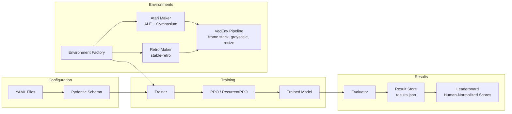

# GOLDS

**Game-Oriented Learning and Development System** -- A curated RL model zoo with PPO training, benchmarks, and research documentation.

<!-- Badges placeholder -->
<!--  -->
<!--  -->
<!--  -->
<!--  -->

## Overview

GOLDS trains reinforcement learning agents on classic video games using Stable-Baselines3 PPO and evaluates them against published baselines. It covers Atari 2600, NES, SNES, Game Boy, and Genesis platforms through a unified CLI and YAML-driven configuration system.

Key features:

- **PPO training via SB3** with schedule support (constant, linear, and cosine LR decay; linear clip annealing)
- **17 registered games** across Atari 2600, NES, SNES, Game Boy, and Genesis
- **Self-play support** for fighting games (Mortal Kombat II, Street Fighter II) with snapshot-based opponent sampling and Elo tracking
- **Structured results storage** with human-normalized scores, per-game leaderboards, and CSV/JSON export
- **5 educational Jupyter notebooks** covering PPO theory, environment pipelines, training analysis, reward engineering, and model zoo cards -- with LaTeX math
- **RecurrentPPO (LSTM)** support via sb3-contrib (`CnnLstmPolicy`)
- **Telegram notifications** for training alerts (start, completion, failure)

## Architecture



## Quick Start

### Installation

```bash
# Install uv (if not already installed)
curl -LsSf https://astral.sh/uv/install.sh | sh

# Clone and install
git clone <repo-url> golds && cd golds
uv sync

# Verify installation
uv run golds doctor
```

### ROM Setup

Atari games work out of the box via `ale-py`. Retro games (NES, SNES, Genesis, Game Boy) require ROM files:

```bash
# Place legally obtained ROMs in the roms/ directory, then:
uv run golds rom import ./roms
uv run golds rom verify SuperMarioBros-Nes
```

### Train a Game

```bash
# Quick start with defaults
uv run golds train game space_invaders --timesteps 1000000 --envs 8

# Full config-driven training
uv run golds train run --config configs/games/space_invaders.yaml
```

### Evaluate a Model

```bash
uv run golds eval model outputs/space_invaders/best/best_model.zip \
    --game space_invaders --episodes 20

# Multi-seed benchmark (100 episodes x 3 seeds)
uv run golds eval benchmark outputs/space_invaders/best/best_model.zip \
    --game space_invaders --episodes 100 --seeds 42,123,456
```

## Command Reference

### `golds train` -- Training

| Command | Description | Example |
|---------|-------------|---------|
| `train run` | Run training from a YAML config | `golds train run --config configs/games/pong.yaml` |
| `train game` | Quick-train a game with CLI args | `golds train game breakout --timesteps 5000000 --envs 16` |
| `train preflight` | Verify config can create and step envs | `golds train preflight --config configs/games/tetris.yaml` |
| `train list-configs` | List available YAML configs | `golds train list-configs` |

### `golds eval` -- Evaluation

| Command | Description | Example |
|---------|-------------|---------|
| `eval model` | Evaluate a trained model | `golds eval model model.zip --game pong --episodes 20` |
| `eval compare` | Compare multiple models | `golds eval compare model_a.zip model_b.zip --game pong` |
| `eval benchmark` | Multi-seed standardized benchmark | `golds eval benchmark model.zip --game pong --episodes 100` |

### `golds results` -- Results Management

| Command | Description | Example |
|---------|-------------|---------|
| `results show` | Display training results | `golds results show --game space_invaders` |
| `results leaderboard` | Cross-game leaderboard with HNS | `golds results leaderboard` |
| `results export` | Export to CSV or JSON | `golds results export --format csv --output results.csv` |

### `golds rom` -- ROM Management

| Command | Description | Example |
|---------|-------------|---------|
| `rom import` | Import ROMs to stable-retro | `golds rom import ./roms` |
| `rom list` | List available retro games | `golds rom list --platform nes` |
| `rom verify` | Verify a game can be loaded | `golds rom verify SuperMarioBros-Nes` |
| `rom info` | Show ROM setup instructions | `golds rom info` |

### Top-level Commands

| Command | Description |
|---------|-------------|
| `golds list-games` | List all 17 registered games |
| `golds info` | Show system info (GPU, retro status) |
| `golds doctor` | Check all dependencies and configuration |
| `golds version` | Print version |
| `golds tensorboard` | Launch TensorBoard for training logs |

## Configuration

Training is driven by YAML configs validated through Pydantic. All fields have sensible defaults; only `name`, `environment.platform`, and `environment.game_id` are required.

```yaml
# configs/games/space_invaders.yaml
name: space_invaders
description: "Space Invaders Atari 2600 with DeepMind PPO settings"
round: 1                              # Training round number (for iterative runs)

environment:
  platform: atari                      # atari | retro
  game_id: space_invaders
  n_envs: 16
  frame_stack: 4
  terminal_on_life_loss: true
  reward_regime: clipped               # clipped | raw | normalized
  # Self-play fields (retro fighting games only):
  # players: 2
  # opponent: self_play                # none | random | noop | model | self_play

ppo:
  learning_rate: 2.5e-4
  lr_schedule: constant                # constant | linear | cosine
  clip_schedule: constant              # constant | linear
  n_steps: 128
  batch_size: 256
  n_epochs: 4
  ent_coef: 0.01
  policy: CnnPolicy                    # CnnPolicy | CnnLstmPolicy

training:
  total_timesteps: 30000000
  eval_freq: 100000
  eval_episodes: 10
  save_freq: 500000
  device: auto                         # auto | cuda | cpu
  seed: 42
```

## Notebooks

| # | Notebook | Description |
|---|----------|-------------|
| 1 | `01_ppo_theory.ipynb` | PPO algorithm derivation with LaTeX math (clipping, GAE, value loss) |
| 2 | `02_environment_pipeline.ipynb` | Atari/retro preprocessing: frame stacking, grayscale, reward clipping |
| 3 | `03_training_analysis.ipynb` | TensorBoard log parsing, learning curves, and convergence diagnostics |
| 4 | `04_reward_engineering.ipynb` | Reward regimes (clipped vs raw vs normalized), reward shaping trade-offs |
| 5 | `05_model_zoo_cards.ipynb` | Model cards for trained agents: scores, hyperparameters, comparisons |

All notebooks live in the `notebooks/` directory.

## Project Structure

```
golds/
├── src/golds/
│   ├── cli/                    # Typer CLI (train, eval, results, rom, top-level)
│   │   ├── main.py
│   │   ├── train.py
│   │   ├── evaluate.py
│   │   ├── results.py
│   │   └── roms.py
│   ├── config/                 # YAML loader + Pydantic schemas
│   │   ├── loader.py
│   │   └── schema.py
│   ├── environments/           # Environment factory + platform makers
│   │   ├── factory.py
│   │   ├── registry.py         # 17 registered games
│   │   ├── atari/              # ALE / Gymnasium maker
│   │   └── retro/              # stable-retro maker + self-play
│   ├── training/               # Trainer, callbacks, schedules, Elo
│   │   ├── trainer.py
│   │   ├── callbacks.py
│   │   ├── schedules.py
│   │   └── elo.py
│   ├── evaluation/             # Evaluator (single, compare, benchmark)
│   │   └── evaluator.py
│   ├── results/                # JSON result store + baselines
│   │   ├── store.py
│   │   ├── schema.py
│   │   └── baselines.py
│   ├── notifications/          # Telegram alerts
│   │   └── telegram.py
│   └── utils/                  # Device detection helpers
│       └── device.py
├── configs/
│   ├── defaults.yaml
│   └── games/                  # Per-game YAML configs (13 files)
├── notebooks/                  # 5 educational Jupyter notebooks
├── tests/                      # pytest test suite
├── scripts/                    # Setup and utility scripts
├── roms/                       # ROM directory (gitignored)
├── golds-tracking/             # Experiment tracking data
├── pyproject.toml              # Project metadata, dependencies, tool config
└── uv.lock
```

## Supported Games

### Atari 2600 (10 games)

| Game ID | Display Name | Env ID |
|---------|-------------|--------|
| `space_invaders` | Space Invaders | SpaceInvadersNoFrameskip-v4 |
| `breakout` | Breakout | BreakoutNoFrameskip-v4 |
| `pong` | Pong | PongNoFrameskip-v4 |
| `qbert` | Q*bert | QbertNoFrameskip-v4 |
| `seaquest` | Seaquest | SeaquestNoFrameskip-v4 |
| `asteroids` | Asteroids | AsteroidsNoFrameskip-v4 |
| `ms_pacman` | Ms. Pac-Man | MsPacmanNoFrameskip-v4 |
| `montezuma_revenge` | Montezuma's Revenge | MontezumaRevengeNoFrameskip-v4 |
| `enduro` | Enduro | EnduroNoFrameskip-v4 |
| `frostbite` | Frostbite | FrostbiteNoFrameskip-v4 |

### NES (3 games)

| Game ID | Display Name | Env ID |
|---------|-------------|--------|
| `super_mario_bros` | Super Mario Bros. | SuperMarioBros-Nes |
| `super_mario_bros_2_japan` | Super Mario Bros. 2 Japan (Lost Levels) | SuperMarioBros2Japan-Nes |
| `mega_man_2` | Mega Man 2 | MegaMan2-Nes |

### Genesis (3 games)

| Game ID | Display Name | Env ID |
|---------|-------------|--------|
| `mortal_kombat_ii` | Mortal Kombat II | MortalKombatII-Genesis |
| `sonic_the_hedgehog` | Sonic the Hedgehog | SonicTheHedgehog-Genesis |
| `street_fighter_ii` | Street Fighter II | StreetFighterIISpecialChampionEdition-Genesis |

### Game Boy (1 game)

| Game ID | Display Name | Env ID |
|---------|-------------|--------|
| `tetris` | Tetris | Tetris-GameBoy |

## Development

### Prerequisites

```bash
uv sync --all-extras   # install dev dependencies
```

### Running Tests

```bash
uv run pytest                    # run all tests
uv run pytest --cov=golds       # with coverage
uv run pytest tests/test_config.py  # single file
```

### Code Style

```bash
uv run ruff check src/ tests/   # lint
uv run ruff format src/ tests/  # format
```

### Type Checking

```bash
uv run mypy src/golds/
```

Configuration for ruff and mypy lives in `pyproject.toml`.

## License

MIT License
